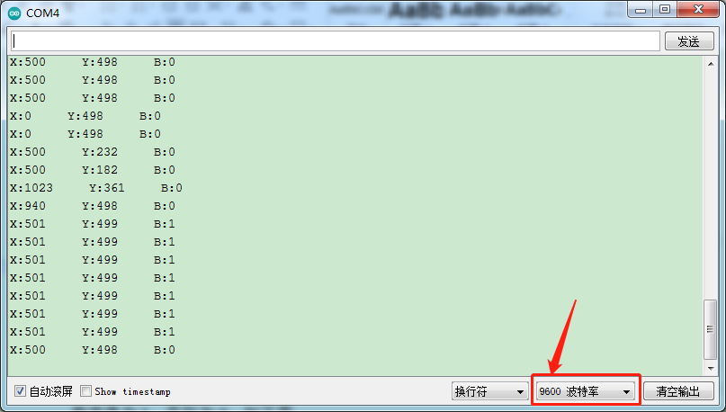

# Arduino


## 1. Arduino简介  

Arduino是一种开源电子原型平台，旨在帮助用户进行互动项目的开发。它支持多种传感器和模块，用户可以通过简单的编程（基于C/C++语言）构建各种有趣的项目。Arduino适合初学者，提供了易于使用的开发环境（IDE）以及大规模的社区支持。用户可以快速学习电子原理和编程技术，开发如机器人、自动化以及智能家居等应用。  

## 2. 接线图  

  

## 3. 测试代码（测试软件版本：Arduino 1.8.12）  

```arduino  
int X = 0;  
int Y = 0;  
int Button = 0;  

void setup() {  
    Serial.begin(9600);  
    pinMode(7, INPUT); // 定义遥感按钮的PIN为数字口7  
}  

void loop() {  
    X = analogRead(A3); // 遥感的X轴引脚接模拟值A3  
    Y = analogRead(A2); // 遥感的Y轴引脚接模拟值A2  
    Button = digitalRead(7); // 读取按钮的状态，并在下方打印出来  
    Serial.write("X:");  
    Serial.print(X);  
    Serial.write(" Y:");  
    Serial.print(Y);  
    Serial.write(" B:");  
    Serial.println(Button);  
    delay(100);  
}  
```  

## 4. 代码说明  

在实验中，根据接线，x管脚设置为A3，y管脚设置为A2，摇杆按钮管脚设置为7，串口监视器显示测试数据，显示前需设置波特率（我们默认设置为9600，可更改）。  

## 5. 测试结果  

上传测试代码成功，利用USB线上电后，打开串口监视器，设置波特率为9600。串口监视器显示对应数值。摇动摇杆，x轴和y轴对应的模拟值发生改变，按下按钮，读取到的数字值为1，否则为0，如下图  




