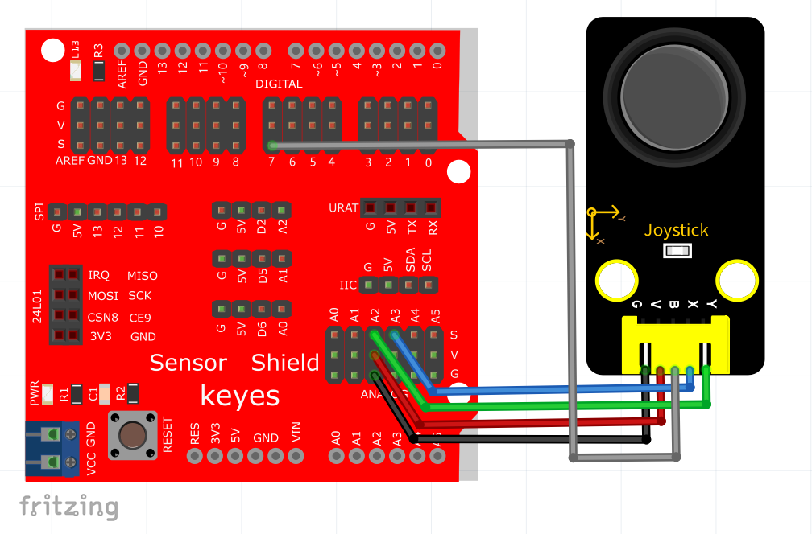
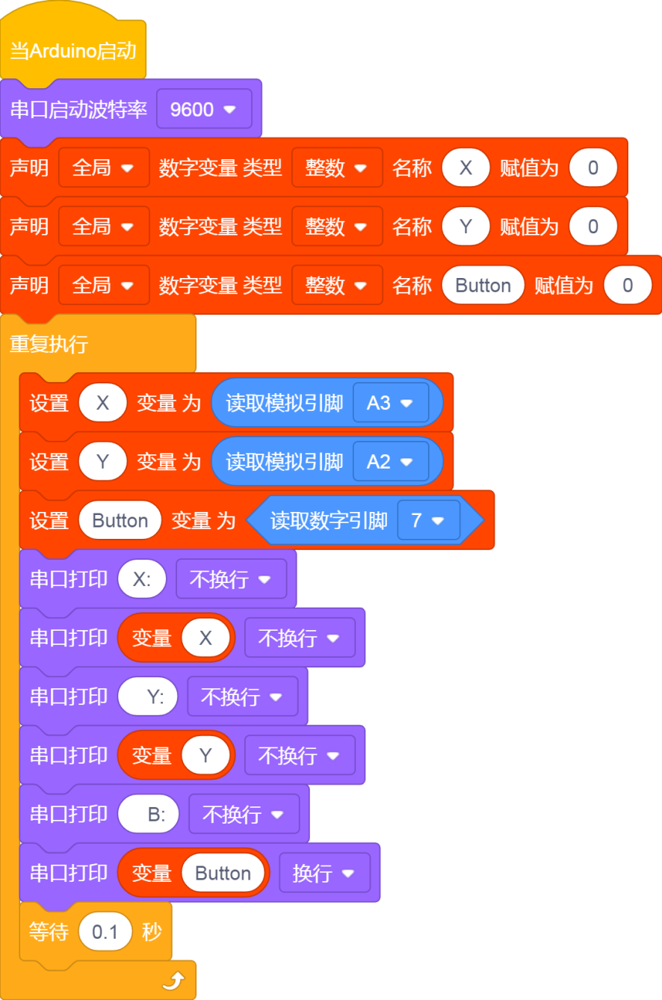
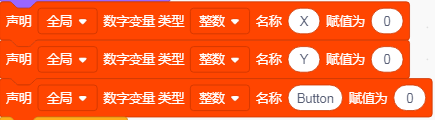
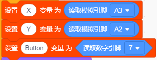
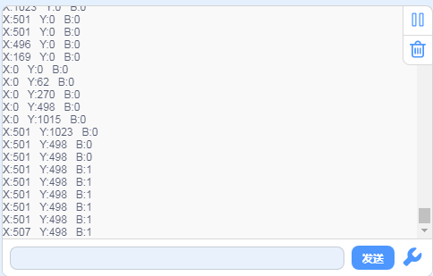

# KidsBlock

## 1. KidsBlock简介  

KidsBlock是一款基于图形化编程的学习平台，旨在使初学者和儿童轻松掌握编程和电子项目。通过简单易用的图形化界面，用户可以通过拖动模块开发代码，快速实现与Arduino等硬件的交互。KidsBlock支持多种功能模块，包括传感器、马达等，适合用于教育机构和个人学习。其丰富的示例项目和友好的用户体验，使得学习编程与机器人技术变得简单而有趣。  

## 2. 接线图  

  

## 3. 测试代码（测试软件版本：KidsBlock Desktop 1.1.2）  

  

## 4. 代码说明  

1. 我们先定义三个整形变量X、Y和Button。X用来存放X轴模拟值，Y用来存放Y轴模拟值，Button存储按键值。  

  

2. 我们这里X轴管脚接模拟口A3，Y轴管脚接模拟口A2，然后按钮我们这里接数字口7，因此信号读取的代码需要放在循环函数中，以便持续读取信号。  

  

## 5. 测试结果  

上传测试代码成功，利用USB线上电后，串口监视器显示对应数值。摇动摇杆，X轴和Y轴对应的模拟值发生改变，按下按钮，读取到的数字值为1，否则为0，如下图。  

