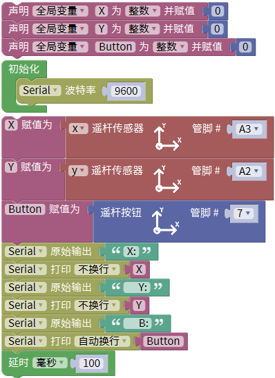
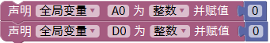
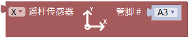
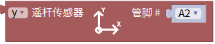
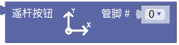
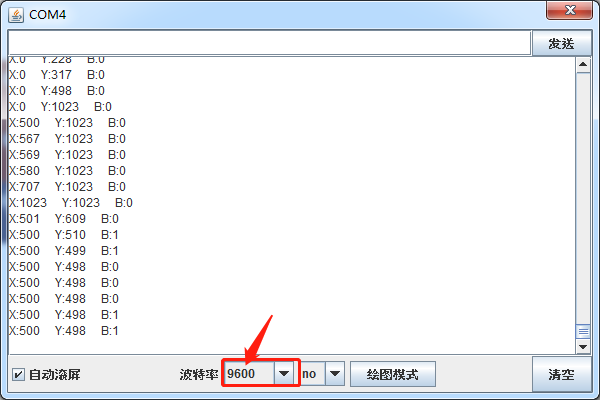

# Mixly

## 1. Mixly简介  

Mixly是一款基于图形化编程的学习平台，旨在让儿童和初学者轻松掌握编程和电子项目。通过易于使用的图形化界面，用户可以通过拖动模块来开发代码，快速实现与Arduino等硬件的交互。Mixly支持多种功能模块，包括传感器、马达等，适合用于教育机构和个人学习。其丰富的示例项目和友好的用户体验，使学习编程与机器人技术变得简单而有趣。  

## 2. 接线图  

  

## 3. 测试代码（测试软件版本：Mixly 1.2.0）  

  

## 4. 代码说明  

1. 我们先导入库keyes sensor，并定义三个整形变量X、Y和Button。X用来存放X轴模拟值，Y用来存放Y轴模拟值，Button存储按键值。  

  

2. 在导入的库keyes sensor下的“其他模块”单元找到摇杆传感器模块，X轴管脚接模拟口A3，Y轴管脚接模拟口A2。   

  
  

3. 然后在库keyes sensor下的“其他模块”单元找到摇杆按钮模块，并将按钮管脚接数字口7。   

  
  

## 5. 测试结果  

上传测试代码成功，利用USB线上电后，打开串口监视器，设置波特率为9600。串口监视器显示对应数值。摇动摇杆，X轴和Y轴对应的模拟值发生改变，按下按钮，读取到的数字值为1，否则为0，如下图。  

