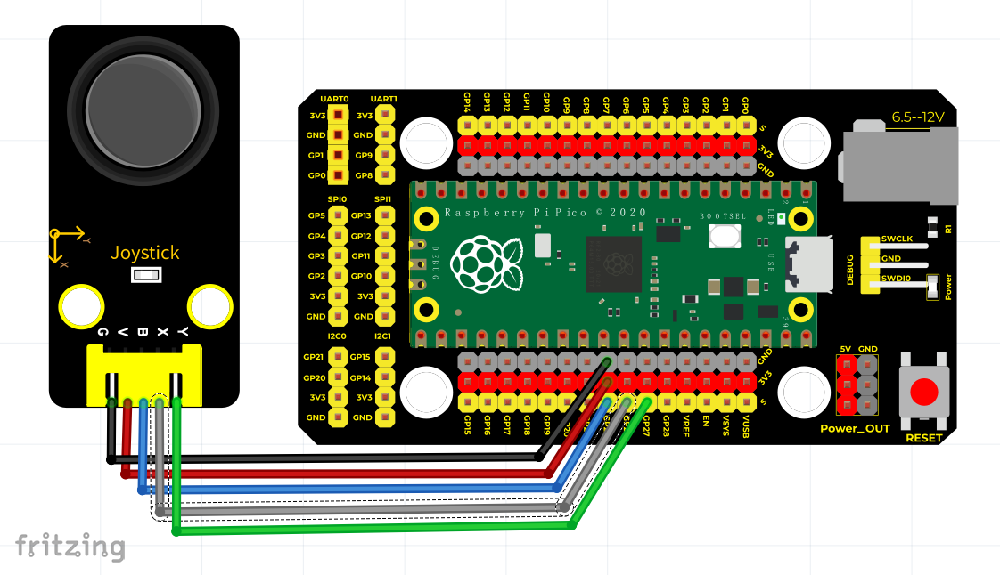
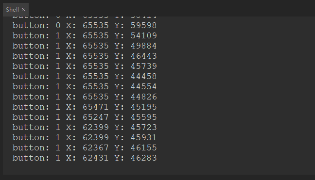

# Python


## 1. Python简介  

Python是一种高级编程语言，以其简洁的语法和强大的功能而受到广泛欢迎。它支持多种编程范式，包括面向对象编程和过程式编程。Python的设计理念强调代码的可读性和简洁性，具有丰富的标准库和强大的第三方模块，使得用户能够轻松进行数据分析、Web开发、自动化脚本编写以及各种其他领域的应用。Python的跨平台特性使其在不同的操作系统上都能良好运行。由于其易学性和强大功能，Python成为了很多初学者和专业开发者的首选语言。  

## 2. 接线图  

  

| 树莓派pico | 摇杆模块 |  
| ---------- | --------- |  
| 3.3V      | V         |  
| GND       | G         |  
| GPIO22    | B         |  
| GPIO26    | X         |  
| GPIO27    | Y         |  

## 3. 测试代码（测试软件版本：Thonny 3.3.3）  

```python  
import machine  
import utime  

B = machine.Pin(22, machine.Pin.IN)  # 设置按键输入  
X = machine.ADC(26)                   # 设置X轴为ADC(26)  
Y = machine.ADC(27)                   # 设置Y轴为ADC(27)  

while True:  
    B_value = B.value()               # 读取按钮的值  
    X_value = X.read_u16()            # 读取X轴的模拟值  
    Y_value = Y.read_u16()            # 读取Y轴的模拟值  
    
    print("button:", end=" ")          # 打印按钮值  
    print(B_value, end=" ")            # 打印X轴值  
    print("X:", end=" ")  
    print(X_value, end=" ")            # 打印X轴值  
    print("Y:", end=" ")  
    print(Y_value)                     # 打印Y轴值  
    
    utime.sleep(0.1)                  # 延时0.1秒  
```  

## 4. 代码说明  

在实验中，根据接线，X管脚设置为ADC(26)，Y管脚设置为ADC(27)，摇杆按钮管脚设置为GP22并且为输入模式。显示数据时，我们的print()函数后面加了end=" "，这样使打印数据时不换行，而是连续输出。  

## 5. 测试结果  

运行测试代码成功，观察下方Shell显示对应数值。摇动摇杆，X轴和Y轴对应的模拟值发生改变，按下按钮，读取到的数字值为1，否则为0，如下图。  




